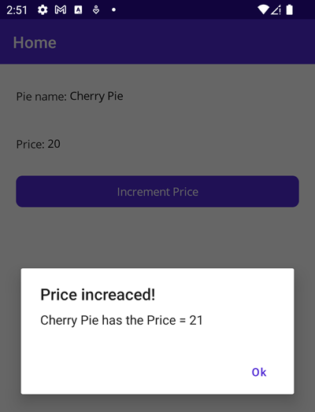

# BindingModes_IPNC

## Demo af Modes
Prøv at ændre `PieName` og `Price` og klik på knappen. Kun `PieName` kan ændres fordi `Mode="TwoWay"` default og `Price` er sat til `Mode="OneWay"`.

&nbsp;

## Demo af manglende ChangeNotification
Klik på knappen og se at Price godt nok ændrer sig i modellen, men at det ikke synkroniseres ud på UI.

&nbsp;

## Demo af ChangeNotification
Udskift Pie modellen med en klasse, der har INPC eller ChangeNotification.

Klik på knappen og se at Price nu synkroniseres ud på UI.

&nbsp;